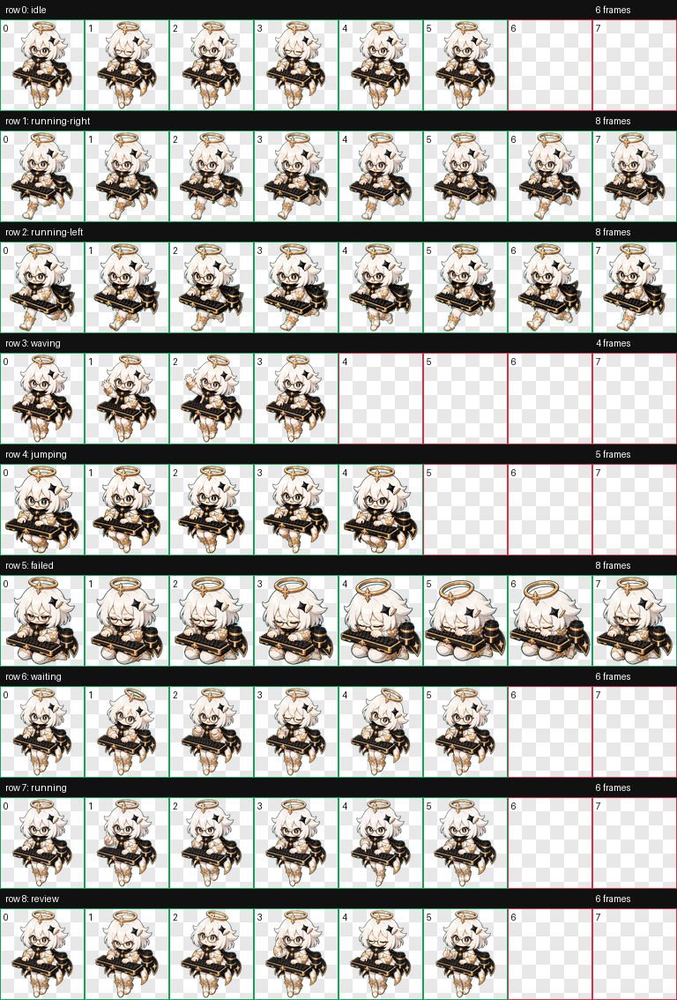
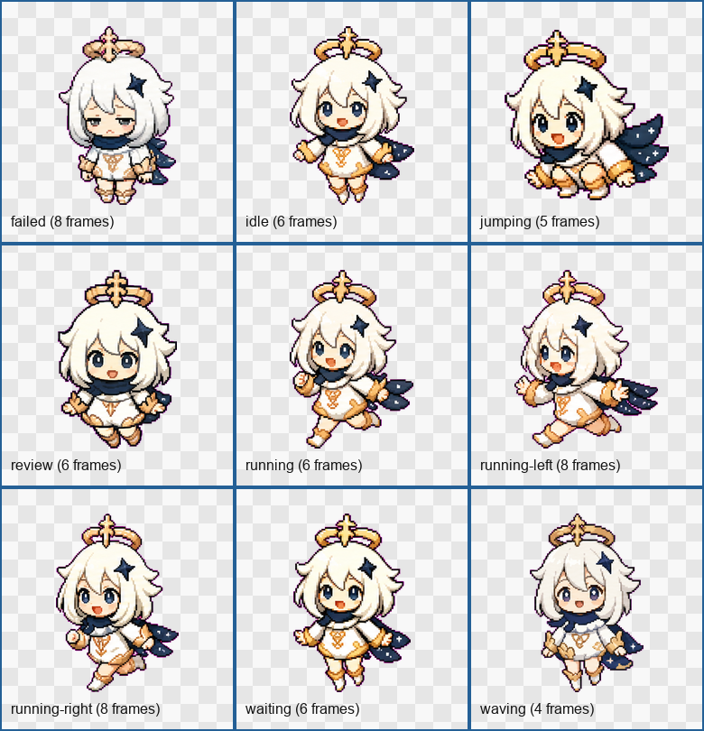

# 派蒙 Codex Pet

这是一个用于 Codex 桌面端的自定义 pet 包。角色方向是“派蒙灵感”的小型数字伙伴：白色短发、金色小冠、星形发饰、白蓝金配色、夸张表情和轻量像素风轮廓。

> 说明：这是 fan-made / inspired 自定义素材，不是官方资源，也不与 HoYoverse、miHoYo、Genshin Impact 或 OpenAI 存在授权、赞助或背书关系。



## 安装

把仓库里的 `pet/paimon` 文件夹复制到 Codex 的 pets 目录：

```powershell
Copy-Item -Recurse -Force .\pet\paimon "$env:USERPROFILE\.codex\pets\paimon"
```

然后重启 Codex，或在命令菜单里执行 `Force Reload Skills` / reload assets。

安装后的目录应当是：

```text
%USERPROFILE%\.codex\pets\paimon\
  pet.json
  spritesheet.png
```

`pet.json` 当前指向 `spritesheet.png`。这是为了兼容部分 Codex 桌面版本：这些版本可以在设置中发现 WebP pet，但选择时可能加载失败。

## 当前加载包

- `pet/paimon/pet.json`：Codex pet manifest。
- `pet/paimon/spritesheet.png`：实际加载的 1536x1872 RGBA spritesheet。
- `pet/paimon/spritesheet.webp`：WebP 归档版本，仅保留用于对比。

## 动画状态

正式 pet 仍遵循 Codex 8x9 atlas，单格为 192x208。不要随意增加 atlas 行，否则 Codex 加载器可能不识别。

| 行 | 状态 | 帧数 | 用途 |
| --- | --- | ---: | --- |
| 0 | `idle` | 6 | 常驻待机、眨眼 |
| 1 | `running-right` | 8 | 向右移动 |
| 2 | `running-left` | 8 | 向左移动，独立生成，没有镜像 |
| 3 | `waving` | 4 | 打招呼 |
| 4 | `jumping` | 5 | 开心跳跃 |
| 5 | `failed` | 8 | 失败、眩晕、委屈 |
| 6 | `waiting` | 6 | 等待、催促感 |
| 7 | `running` | 6 | 通用跑动 |
| 8 | `review` | 6 | 思考、检查、审阅 |

## 扩展素材

为了让仓库更适合展示和二次整理，我额外加入了素材目录。这些素材不会影响 Codex pet 加载。

- `assets/manifest.json`：素材索引，记录正式加载包、状态帧、表情帧、补充图和预览图。
- `assets/frames/`：从最终 atlas 抽出的全部透明单帧。
- `assets/expressions/`：精选表情单帧，包括普通、眨眼、问候、兴奋、眩晕、难过、思考、等待。
- `assets/gallery/expressions-overview.png`：精选表情总览。
- `assets/gallery/states-overview.png`：九个正式状态的首帧总览。
- `assets/supplemental/expression-sheet.png`：补充表情参考图。
- `assets/supplemental/action-sheet.png`：补充动作参考图。

补充素材用于丰富文档和后续迭代，不是当前 `pet.json` 的加载入口。




## QA

仓库自带校验脚本，只依赖 Python 标准库。在仓库根目录运行即可重新验证整个包：

```powershell
python tools\validate_atlas.py
```

预期输出最后一行是 `Result: ok`，表示正式 spritesheet 是 1536x1872 RGBA PNG、8x9 atlas、192x208 单格，且 manifest 里列出的状态帧和表情帧都齐全。

原始构建时的验证结果也保留在 `qa/` 下：

- `qa/review.json`：`ok: true`，0 errors，0 warnings。
- `qa/validation-png.json`：`ok: true`，1536x1872 RGBA PNG，0 errors，0 warnings。
- `qa/validation.json`：`ok: true`，1536x1872 RGBA WebP，0 errors，0 warnings。
- `qa/videos/*.mp4`：九个状态的预览视频。
- 注：`qa/*.json` 是在原始构建机上生成的，里面的绝对路径指向那台机器，仅作为原始验证记录；跨机器复验请用上面的 `tools\validate_atlas.py`。

## 排错

如果设置里能看到 Paimon，但选择后无法加载：

1. 确认 `pet.json` 中是 `"spritesheetPath": "spritesheet.png"`。
2. 确认 `spritesheet.png` 和 `pet.json` 在同一个目录。
3. 确认 `pet.json` 是 UTF-8 无 BOM。
4. 重启 Codex，或执行 `Force Reload Skills` / reload assets。
5. 如果仍失败，优先查看 Codex 桌面端日志，而不是重新生成素材。

## 迭代原则

为了避免再次破坏 Codex 加载，后续迭代遵循：

1. 正式加载包只保留 `pet/paimon/pet.json` 和 `pet/paimon/spritesheet.png`。
2. `spritesheet.png` 必须保持 1536x1872、RGBA、8x9 atlas、192x208 单格。
3. 新动作和新表情先进入 `assets/`，通过文档和 manifest 管理。
4. 只有重新跑完 atlas 验证、contact sheet 检查和本地加载验证后，才把新动作合并进正式 atlas。

## English Summary

This repository contains a fan-made Codex desktop pet inspired by Paimon. The active package uses a PNG spritesheet for better Codex desktop compatibility. Extra frames and supplemental expression/action sheets are included for documentation and future iteration, but the loadable Codex pet remains the fixed 8x9 atlas under `pet/paimon`.

## 版权与使用

本项目不授予任何第三方角色、商标或游戏 IP 的授权。建议作为个人自定义 Codex pet 使用；如果要公开分发、商用或放入产品，请先确认你拥有相应权利。
